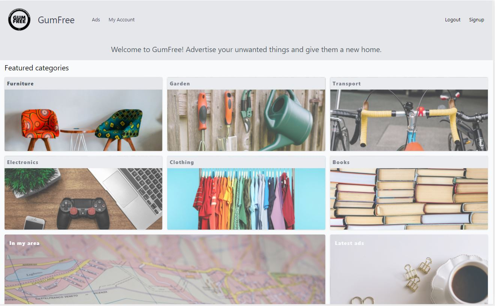

# Gumfree
An app for sharing items in your local area.

[Heroku deployment](https://gum-free.herokuapp.com/)

## Table of Contents
* [Description](#description)
* [Installation](#installation)
* [Screenshot](#screenshot)
* [Contributions](#contributions)

## Description

Just under a third of people (30%) have thrown away furniture, electrical items and homewares in good enough condition that they could have been re-used, sold or donated. A fifth of 16-24 year olds (19%) ‘don’t know’ how to recycle or donate - GumFree is attempting to close in on these statistics and get more people recycling in the UK by offering a place to advertise unwanted items to the community.

The backend functionality of the app comes from Node.js, Express, MySQL and Sequelize and the front end and styling is achieved using Handlebars and Tailwind CSS.

## Installation 

Run npm i to install all dependencies. Create a .env file with your MySql credentials and database name.

## Screenshot

## Contributions

Ross, Luke and Oli
